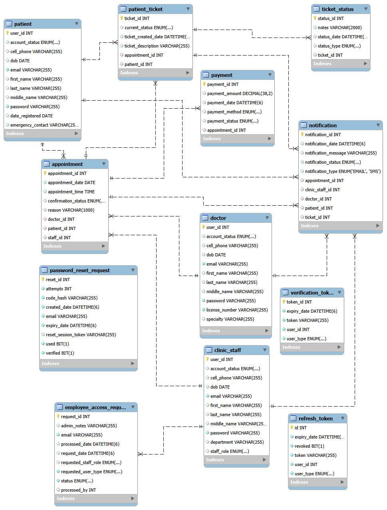

# MediTicket2

## Project Overview
MediTicket2 is a healthcare management system developed using Java, Spring Boot, Maven, and Domain-Driven Design (DDD) principles.

The system manages:
* Patients
* Doctors
* Clinic Staff
* Appointments
* Patient Tickets
* Ticket Status Tracking
* Payments
* Notifications

The project follows a layered architecture consisting of:
* Domain Layer
* Factory Layer
* Repository Layer
* Service Layer
* Controller Layer
* Test Layer

---

## UML Class Diagram


---

## Technology Stack
* Java 21
* Spring Boot 4.1.0
* Maven
* JPA / Hibernate
* MySQL 8
* Spring Security + JWT (jjwt)
* Spring Mail (Gmail SMTP)
* JUnit 5
* Mockito
* GitHub
* Railway (deployment + hosting)
* IntelliJ IDEA

---

## Backend Implementation Status

### ✅ Core Domain & Persistence
All entities, factories, repositories, and services listed below are implemented and fully wired to a MySQL database via Spring Data JPA:
* Patient, Doctor, ClinicStaff, User (base class)
* Appointment
* PatientTicket, TicketStatus
* Payment
* Notification
* EmployeeAccessRequest
* RefreshToken, VerificationToken, PasswordResetRequest

Schema is auto-managed via Hibernate (`spring.jpa.hibernate.ddl-auto=update`), including all foreign key constraints and unique constraints (e.g. unique email per user type, unique license number for doctors).

### ✅ Authentication & Security
Full JWT-based authentication system implemented, including:
* Patient self-signup with email verification
* Employee (Doctor / Clinic Staff) invite-based signup flow
* Login issuing JWT access + refresh tokens
* Refresh token rotation endpoint
* Change password / forgot password / reset password (email-based reset codes)
* First-admin bootstrap endpoint, protected by a secret key and a one-time-only guard (refuses to run again once an ADMIN exists)
* Employee access request workflow (self-service request → admin approval/rejection)
* Custom `JwtAuthFilter` — stateless, header-based (`Authorization: Bearer <token>`), sets Spring Security context directly from validated JWT claims (userId, userType, staffRole)
* Role-based endpoint protection via `SecurityConfig` (`hasRole("ADMIN")` for sensitive employee-management endpoints, `permitAll()` for pre-account auth flows, `authenticated()` for everything else)
* Passwords hashed with BCrypt

### ✅ Email Integration
Gmail SMTP integration for:
* Account verification emails (patients)
* Employee invitation emails
* Password reset codes

### ✅ Configuration & Environment
* All secrets and environment-specific values (DB credentials, JWT secret, mail credentials, bootstrap admin key, base URLs) externalized via environment variables
* Local development uses a `.env` file, loaded via Spring Boot's native `spring.config.import=optional:file:.env[.properties]`
* `.env` is git-ignored — no secrets committed to the repository

### ✅ Deployment
* Backend deployed and running live on **Railway**
* MySQL database provisioned on Railway, linked to the app service via variable references
* Public app URL: `https://mediticket2-production.up.railway.app`
* Verification and invite email links configured to point to the live Railway domain (not localhost)

### ✅ Desktop Client Integration
* Java Swing desktop frontend (FlatLaf + MigLayout) connects to the backend via a shared `BaseApiClient`
* Client's API base URL is configurable via system property (`-Dapi.base.url=...`), defaulting to the live Railway backend
* Supports GET / POST / PUT / PATCH / DELETE, automatic JWT attachment to requests, and Jackson-based JSON (de)serialization with Java 8 time support

### 🔧 Database Management
* Live production MySQL database accessible for inspection/management via MySQL Workbench, tunneled securely through the Railway CLI (`railway connect MySQL --tunnel-only`) — no public database exposure required

---

## Project Structure
```text
src
└── main
    └── java
        └── za.ac.cput
            ├── config
            ├── controller
            ├── domain
            │   ├── auth
            │   ├── enums
            │   ├── user
            │   └── valueObject
            ├── dto
            ├── factory
            ├── repository
            ├── security
            ├── service
            │   └── impl
            └── util
```

---

## Team Members and Entity Allocation
| Team Member            | Student Number | Entity                            |
| ---------------------- | -------------- | --------------------------------- |
| Abdullahi Raage Farah  | 230971091      | Payment, TicketStatus             |
| Aidan Barends          | 230155639      | Patient                           |
| Jaden Clayton Abrahams | 222206721      | Doctor                            |
| Joshua Peter Bonzet    | 221312536      | Appointment                       |
| Joshua Reid Adams      | 230317693      | PatientTicket, User               |
| Matthew Barron         | 230398863      | ClinicStaff                       |
| Raul Jaaim Everts      | 230270564      | Notification                      |

---

## Branch Naming Convention
Each team member will work on their own branch.

**Format**
```text
INITIALS-StudentNumber
```

**Branches**
```text
ARF-230971091
AB-230155639
JCA-222206721
JPB-221312536
JRA-230317693
MB-230398863
RJE-230270564
```

---

## Development Workflow

### 1. Pull the Latest Code
```bash
git checkout main
git pull origin main
```

### 2. Switch to Your Branch
```bash
git checkout <branch-name>
```

### 3. Complete Your Assigned Tasks
Implement the required repository, service, controller and tests.

### 4. Commit Changes
```bash
git add .
git commit -m "Completed assigned implementation"
```

### 5. Push Changes
```bash
git push origin <branch-name>
```

### 6. Create a Pull Request
Submit a Pull Request from your branch to `main`.

### 7. Await Review
The Team Lead will review and merge approved pull requests.

---

## Deliverables Per Entity
Each member is responsible for:

### Repository Layer
* Repository Interface

### Service Layer
* Service Interface
* Service Implementation

### Controller Layer
* REST Controller

### Testing
* Factory Test
* Service Test
* Controller Test

---

## Testing Frameworks
The project uses:
* JUnit 5
* Mockito
* Spring Boot Test

All implementations must include appropriate test classes.

---

## GitHub Milestone

### Domain Milestone
**Due Date:** 21 June 2026

All assigned tasks and pull requests must be completed and merged before the milestone deadline.

---

## Team Lead Responsibilities
* Maintain repository structure
* Review pull requests
* Merge approved code
* Create and manage milestones
* Create and assign issues
* Ensure code quality standards are followed

---

## Contributors
* Joshua Reid Adams (Team Lead)
* Abdullahi Raage Farah
* Aidan Barends
* Jaden Clayton Abrahams
* Joshua Peter Bonzet
* Matthew Barron
* Raul Jaaim Everts
